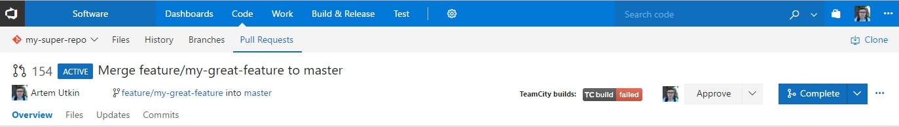
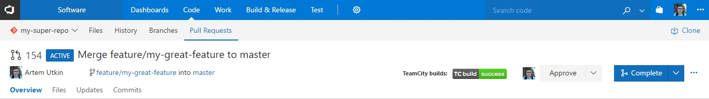
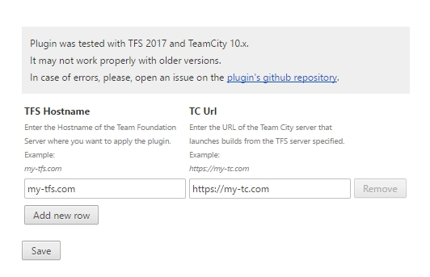

# TeamCity build checker for TFS pull requests

This Chrome extension shows a status of a corresponding TeamCity build on the TFS pull request pages.

No changes to your TFS or TeamCity server are needed.

Tested with:
- TFS 2017
- TeamCity 10.x

## How it works

- The plugin becomes active on the TFS pull request page.
- It receives the id (hash) of the last commit in the current pull request using [TFS Git Api](https://www.visualstudio.com/en-us/docs/integrate/api/git/pull-requests/pull-requests#get-a-pull-request).
- Then it looks for the last build with revision equal to the commit id (hash) defined on the previous step. [TeamCity Api](https://confluence.jetbrains.com/display/TCD10/REST+API) is used for that.
- If build is found the plugin displays an icon indicating build status.

**Note:** you need to configure your build configuration(s) to trigger builds from **feature** branches so the plugin can find builds for commits that are not merged yet into the master (or develop) branch. For more details read the TeamCity documentation: [Working with Feature Branches](https://confluence.jetbrains.com/display/TCD10/Working+with+Feature+Branches).

## How does it look like

## How to configure plugin

Open the options page of the plugin and add the hostname of the TFS and url of the TeamCity. You can add multiple combinations of TFS and TeamCity servers.

